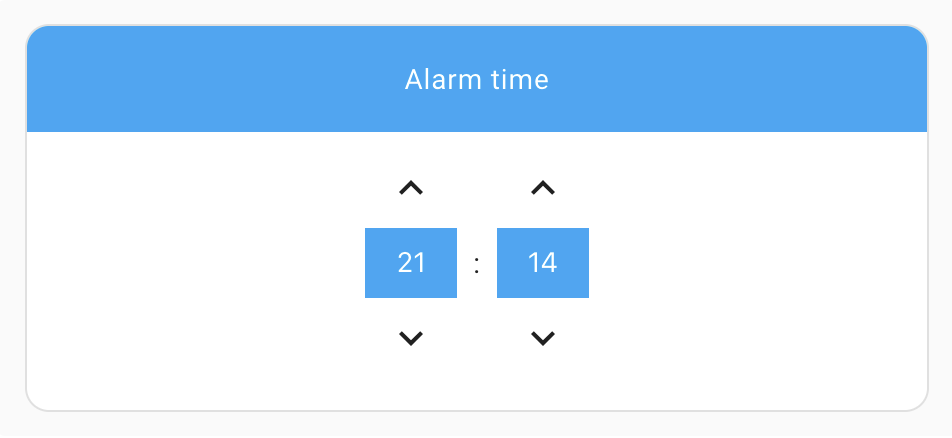
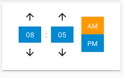
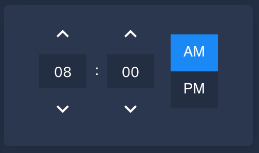

# Time Picker Card by [@georgesg](https://www.github.com/georgesg)

[![hacs_badge][hacs-shield]][hacs]
[![GitHub Release][releases-shield]][releases]

[![Project Maintenance][maintenance-shield]][maintenance]
[![GitHub Activity][commits-shield]][commits]
[![License][license-shield]][license]

## Overview

This is a Time Picker card for [Home Assistant](https://www.home-assistant.io/)'s [Lovelace UI](https://www.home-assistant.io/lovelace).

Requires an [Input Datetime](https://www.home-assistant.io/integrations/input_datetime/) that has time (`has_time: true`).

## Screenshots







## Installation

Install using [HACS](https://hacs.xyz) or follow this [guide](https://github.com/thomasloven/hass-config/wiki/Lovelace-Plugins)

```yaml
resources:
  - url: /local/time-picker-card.js
    type: module
```

## Usage

```yaml
type: 'custom:time-picker-card'
entity: input_datetime.alarm_time
name: 'Choose a time'
hour_mode: 24
hour_step: 1
minute_step: 5
hide:
  name: false
```

## Options

| Name        | Type         | Requirement  | Description                                                                                               | Default                  |
| ----------- | ------------ | ------------ | --------------------------------------------------------------------------------------------------------- | ------------------------ |
| type        | string       | **Required** | `custom:time-picker-card`                                                                                 |                          |
| entity      | string       | **Required** | [Input Datetime](https://www.home-assistant.io/integrations/input_datetime/) entity with `has_time: true` |                          |
| name        | string       | **Optional** | Card name                                                                                                 | Entity's `friendly_name` |
| hour_mode   | `12` or `24` | **Optional** | Hour format. If `12`, card will show AM/PM picker                                                         | `24`                     |
| hour_step   | number       | **Optional** | Hour change when clicking arrows                                                                          | `1`                      |
| minute_step | number       | **Optional** | Minute change when clicking arrows                                                                        | `5`                      |
| hide        | object       | **Optional** | Hide object                                                                                               | `none`                   |

## Hide Object

| Name | Type    | Requirement  | Description         | Default |
| ---- | ------- | ------------ | ------------------- | ------- |
| name | boolean | **Optional** | Hides the card name | `false` |

## Theme Variables

| Name                            | Default                     | Description                                 |
| ------------------------------- | --------------------------- | ------------------------------------------- |
| --tpc-elements-background-color | `var(--dark-primary-color)` | Background color for header and ui elements |
| --tpc-icon-color                | `var(--primary-text-color)` | Arrow color                                 |
| --tpc-text-color                | `white`                     | Text color                                  |
| --tpc-accent-color              | `var(--accent-color)`       | AM / PM active color                        |

## Meta

**Georgi Gardev**

- [gar.dev](https://gar.dev)
- [![GitHub][github-icon]](https://github.com/GeorgeSG/) [GeorgeSG](https://github.com/GeorgeSG/)
- [![Twitter][twitter-icon]](https://twitter.com/georgesg92) [@georgesg92](https://twitter.com/georgesg92)

[commits-shield]: https://img.shields.io/github/commit-activity/y/GeorgeSG/lovelace-time-picker-card?style=flat-square
[commits]: https://github.com/GeorgeSG/lovelace-time-picker-card/commits/master
[license-shield]: https://img.shields.io/github/license/GeorgeSG/lovelace-time-picker-card?style=flat-square
[license]: https://github.com/GeorgeSG/lovelace-time-picker-card/blob/master/LICENSE
[maintenance-shield]: https://img.shields.io/maintenance/yes/2020.svg?style=flat-square
[maintenance]: https://github.com/GeorgeSG/lovelace-time-picker-card
[releases-shield]: https://img.shields.io/github/release/GeorgeSG/lovelace-time-picker-card.svg?style=flat-square
[releases]: https://github.com/GeorgeSG/lovelace-time-picker-card/releases
[hacs-shield]: https://img.shields.io/badge/HACS-Custom-orange.svg?style=flat-square
[hacs]: https://github.com/custom-components/hacs
[twitter-icon]: http://i.imgur.com/wWzX9uB.png
[github-icon]: http://i.imgur.com/9I6NRUm.png
