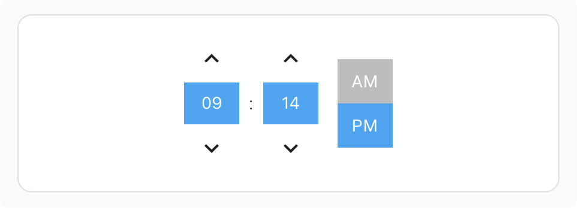
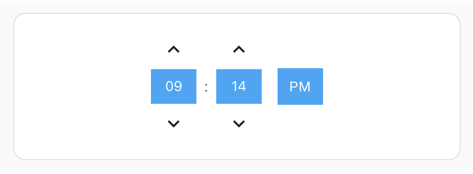
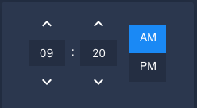
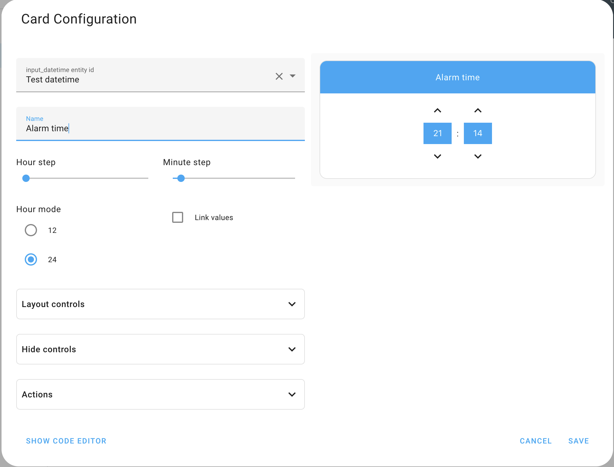

# Time Picker Card by [@georgesg](https://www.github.com/georgesg)

[![hacs_badge][hacs-shield]][hacs]
[![GitHub Release][releases-shield]][releases]

[![Project Maintenance][maintenance-shield]][maintenance]
[![GitHub Activity][commits-shield]][commits]
[![License][license-shield]][license]

## Overview

This is a Time Picker Card for [Home Assistant](https://www.home-assistant.io/)'s [Lovelace UI](https://www.home-assistant.io/lovelace).

Requires an [Input Datetime](https://www.home-assistant.io/integrations/input_datetime/) that has time (`has_time: true`).

## Screenshots

### Default config - card name shown, 24 hour mode


### Custom config - hidden card name, 12 hour mode



### Custom config - hidden card name, 12 hour mode with a "single" hour mode picker



### Using a custom theme



## Installation

Install using [HACS](https://hacs.xyz) or follow this [guide](https://github.com/thomasloven/hass-config/wiki/Lovelace-Plugins)

```yaml
resources:
  - url: /local/time-picker-card.js
    type: module
```

## Usage

### Visual Editor

Time Picker Card supports Lovelace's Visual Editor. Click the + button to add a card and search for time picker.




### YAML

```yaml
type: 'custom:time-picker-card'
entity: input_datetime.alarm_time
name: 'Choose a time'
hour_mode: 24
hour_step: 1
minute_step: 5
hide:
  name: false
```

## Options

| Name        | Type         | Requirement  | Description                                                                                               | Default                  |
| ----------- | ------------ | ------------ | --------------------------------------------------------------------------------------------------------- | ------------------------ |
| type        | string       | **Required** | `custom:time-picker-card`                                                                                 |                          |
| entity      | string       | **Required** | [Input Datetime](https://www.home-assistant.io/integrations/input_datetime/) entity with `has_time: true` |                          |
| name        | string       | **Optional** | Card name                                                                                                 | Entity's `friendly_name` |
| hour_mode   | `12` or `24` | **Optional** | Hour format. If `12`, card will show AM/PM picker                                                         | `24`                     |
| hour_step   | number       | **Optional** | Hour change when clicking arrows                                                                          | `1`                      |
| minute_step | number       | **Optional** | Minute change when clicking arrows                                                                        | `5`                      |
| layout      | object       | **Optional** | Card Layout configuration                                                                                 | `none`                   |
| hide        | object       | **Optional** | Hide object                                                                                               | `none`                   |

## Layout Object

| Name      | Type                 | Requirement  | Description                                                                                        | Default  |
| --------- | -------------------- | ------------ | -------------------------------------------------------------------------------------------------- | -------- |
| hour_mode | `single` or `double` | **Optional** | Whether to show both AM/PM or just the current mode. In `single` mode, tap the value to change it. | `double` |

## Hide Object

| Name | Type    | Requirement  | Description         | Default |
| ---- | ------- | ------------ | ------------------- | ------- |
| name | boolean | **Optional** | Hides the card name | `false` |

## Theme Variables

Time Picker Card will automatically pick up colors from your lovelace theme, but if you want to customize some of them,
you can use the following variables in your theme's config file:

| Name                                  | Default                      | Description                            |
| ------------------------------------- | ---------------------------- | -------------------------------------- |
| time-picker-elements-background-color | `var(--primary-color)`       | Background color for header and inputs |
| time-picker-icon-color                | `var(--primary-text-color)`  | Arrow color                            |
| time-picker-text-color                | `white`                      | Text color                             |
| time-picker-accent-color              | `var(--primary-color)`       | AM / PM active color                   |
| time-picker-off-color                 | `var(--disabled-text-color)` | AM / PM inactive color                 |

## Meta

**Georgi Gardev**

- [gar.dev](https://gar.dev)
- [![GitHub][github-icon]](https://github.com/GeorgeSG/) [GeorgeSG](https://github.com/GeorgeSG/)
- [![Twitter][twitter-icon]](https://twitter.com/georgesg92) [@georgesg92](https://twitter.com/georgesg92)

[commits-shield]: https://img.shields.io/github/commit-activity/y/GeorgeSG/lovelace-time-picker-card?style=flat-square
[commits]: https://github.com/GeorgeSG/lovelace-time-picker-card/commits/master
[license-shield]: https://img.shields.io/github/license/GeorgeSG/lovelace-time-picker-card?style=flat-square
[license]: https://github.com/GeorgeSG/lovelace-time-picker-card/blob/master/LICENSE
[maintenance-shield]: https://img.shields.io/maintenance/yes/2020.svg?style=flat-square
[maintenance]: https://github.com/GeorgeSG/lovelace-time-picker-card
[releases-shield]: https://img.shields.io/github/release/GeorgeSG/lovelace-time-picker-card.svg?style=flat-square
[releases]: https://github.com/GeorgeSG/lovelace-time-picker-card/releases
[hacs-shield]: https://img.shields.io/badge/HACS-Custom-orange.svg?style=flat-square
[hacs]: https://github.com/custom-components/hacs
[twitter-icon]: http://i.imgur.com/wWzX9uB.png
[github-icon]: http://i.imgur.com/9I6NRUm.png
